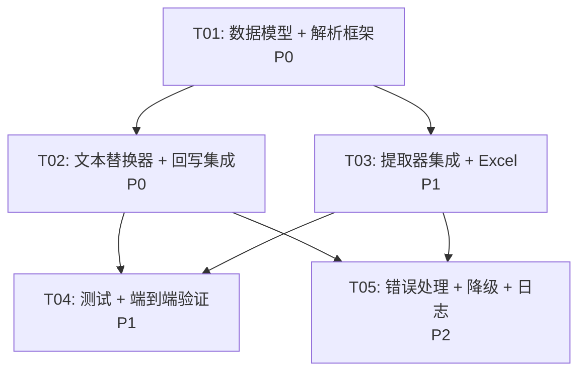

# CADTrans Lite Phase 2 架构设计文档

> **项目**: CADTrans Lite — ACAD_TABLE + MLEADER 实体类型扩展  
> **架构师**: 高见远  
> **日期**: 2026-05-27  
> **版本**: 1.0

---

## 目录

1. [netDxf API 验证结果](#1-netdxf-api-验证结果)
2. [DXF 组码规范研究](#2-dxf-组码规范研究)
3. [提取方案设计](#3-提取方案设计)
4. [回写方案设计](#4-回写方案设计)
5. [降级方案](#5-降级方案)
6. [任务分解](#6-任务分解)
7. [依赖包列表](#7-依赖包列表)
8. [共享知识](#8-共享知识)
9. [任务依赖图](#9-任务依赖图)
10. [待明确事项](#10-待明确事项)

---

## 1. netDxf API 验证结果

### 1.1 验证方法

使用 PowerShell 反射加载 netDxf DLL，遍历所有导出类型和成员。

**验证对象**:
- `netDxf 2022.11.2`（项目当前版本）: `C:\Users\Administrator\.nuget\packages\netdxf\2022.11.2\lib\net6.0\netDxf.dll`
- `netDxf 2023.11.10`（NuGet 最新版）: `C:\Users\Administrator\.nuget\packages\netdxf\2023.11.10\lib\net6.0\netDxf.dll`

### 1.2 ACAD_TABLE 验证结论

| 检查项 | 结果 |
|--------|------|
| `AcadTable` 实体类 | ❌ 不存在 |
| `Table` 实体类（Entities 命名空间） | ❌ 不存在 |
| `DxfObjectCode.AcadTable` 枚举值 | ✅ 存在，值 = `"ACAD_TABLE"` |
| `DrawingEntities` 中 Table 集合属性 | ❌ 不存在 |
| ACAD_TABLE 原生实体支持 | ❌ 不支持 |

**重要发现**: netDxf 将 ACAD_TABLE 实体作为 **INSERT（块参照）** 导入。ACAD_TABLE 在内部关联一个匿名块（`*T` 开头），netDxf 读取时只看到 INSERT 实体，无法直接访问表格行列结构。

引用 netDxf 官方文档原文：
> "AutoCad Table entities will be imported as Inserts (block references)."

### 1.3 MULTILEADER 验证结论

| 检查项 | 结果 |
|--------|------|
| `MultiLeader` 实体类 | ❌ 不存在 |
| `MLeader` 实体类 | ❌ 不存在 |
| `DxfObjectCode.Multileader` 枚举值 | ❌ 不存在 |
| `DrawingEntities` 中 MLeader 集合 | ❌ 不存在 |
| MULTILEADER 任何形式的支持 | ❌ 完全不支持 |

**注意**: netDxf 有 `Leader` 实体类，但这是旧式 LEADER（引线），不是 MULTILEADER。两者是完全不同的实体类型。

### 1.4 netDxf 可用的替代 API

| API | 说明 | 可用于 |
|-----|------|--------|
| `DxfDocument.GetObjectByHandle(string)` → `DxfObject` | 通过 Handle 获取任意对象 | 回写查找 |
| `DxfObject.CodeName` → `string` | 获取实体类型名（如 "ACAD_TABLE", "MULTILEADER"） | 类型识别 |
| `DxfObject.Handle` → `string` | 获取实体句柄 | Handle 读取 |
| `DxfObject.XData` → `XDataDictionary` | 获取扩展数据 | 有限数据访问 |
| `DrawingEntities.All` → `IEnumerable<EntityObject>` | 遍历所有已知实体 | 提取遍历 |
| `DrawingEntities.Inserts` → `IEnumerable<Insert>` | 遍历 INSERT 实体（含 ACAD_TABLE 转换后的块参照） | 间接访问 |

### 1.5 关键结论

**netDxf 不支持 ACAD_TABLE 和 MULTILEADER 的原生读写**。必须通过直接解析 DXF 文件文本的方式实现这两个实体类型的提取和回写。

---

## 2. DXF 组码规范研究

### 2.1 ACAD_TABLE 组码结构

ACAD_TABLE 实体的 DXF 文本结构分为三个子类：

```
0          ACAD_TABLE
5          <Handle>
330        <Owner Handle>
100        AcDbEntity          ← 通用实体属性
8          <Layer Name>
...
100        AcDbBlockReference  ← 块参照属性
2          *T<n>               ← 匿名块名（*T 开头）
10         <Insert X>
20         <Insert Y>
30         <Insert Z>
100        AcDbTable           ← 表格专属属性
280        0                   ← 表数据版本号
342        <TABLESTYLE Handle>
343        <BLOCK_RECORD Handle>
91         <nRows>             ★ 行数
92         <nCols>             ★ 列数
141        <rowHeight> × nRows ← 行高（每行重复）
142        <colWidth> × nCols  ← 列宽（每列重复）
171        <cellType> × N      ★ 单元格类型（1=文本, 2=块），每单元格重复
172        <cellFlag> × N      ← 单元格标志，每单元格重复
173        <cellMerge> × N     ← 单元格合并值，每单元格重复
...
```

#### 单元格文本存储（两种 DXF 版本格式）

**DXF R2004 格式**（分割码 171）:
- 单元格按 171 分割
- 文本存储在组码 `1`（< 250 字符）或 `3` + `1`（> 250 字符，组码 3 分块，组码 1 为尾部）

**DXF R2007+ 格式**（分割码 301）:
- 单元格按 301/302 分割
- 组码 `302` 存储完整文本（可超 66000 字符）
- 组码 `303` 用于超长文本分块

#### 单元格遍历顺序

单元格按 **行优先** 顺序排列：`[row0_col0, row0_col1, ..., row1_col0, row1_col1, ...]`

### 2.2 MULTILEADER 组码结构

MULTILEADER 实体的 DXF 文本结构：

```
0               MULTILEADER
5               <Handle>
330             <Owner Handle>
100             AcDbEntity
8               <Layer Name>
...
100             AcDbMLeader
270             2                   ← 版本号
172             <contentType>       ★ 内容类型：2=文本, 1=块, 0=无
...             (公共属性)
300             CONTEXT_DATA{       ← 上下文数据开始
  ...
  302           LEADER{             ← 引线节开始
    ...
    10          <vertex X>          ← 引线顶点
    20          <vertex Y>
    30          <vertex Z>
    ...
  303           }                  ← 引线节结束
  ...
  290           <hasMText>          ★ 是否包含 MTEXT 内容
  304           <textContent>       ★★★ MTEXT 文本内容字符串
  340           <textStyleHandle>   ← 文字样式句柄
  11            <textLocationX>     ← 文字位置
  21            <textLocationY>
  31            <textLocationZ>
  41            <textBoundaryWidth> ← 文字边界宽度
  42            <textBoundaryHeight>
  271           <textHeight>        ← 文字高度
  ...
301             }                   ← 上下文数据结束
```

#### 文本内容关键组码

| 组码 | 描述 | 备注 |
|------|------|------|
| 172 | 内容类型 | 2=文本, 1=块, 0=无 |
| 290 | hasMText | 上下文数据内，是否包含 MTEXT |
| **304** | **文本内容字符串** | ★ 核心提取目标，MTEXT 格式码字符串 |
| 340 | 文字样式句柄 | 上下文数据内 |
| 41 | 文字边界宽度 | 上下文数据内 |
| 271 | 文字高度 | 上下文数据内 |

---

## 3. 提取方案设计

### 3.1 总体策略

由于 netDxf 不支持 ACAD_TABLE 和 MULTILEADER，采用 **双通道提取** 策略：

1. **主通道（netDxf）**: 继续使用 netDxf 提取 TEXT/MTEXT/Attribute（现有逻辑不变）
2. **辅通道（原始 DXF 文本解析）**: 直接读取 DXF 文件文本，解析 ACAD_TABLE 和 MULTILEADER 实体

### 3.2 DXF 原始文本解析器设计

新增 `DxfRawParser` 类，负责直接从 DXF 文本文件中提取 ACAD_TABLE 和 MULTILEADER 实体的数据。

```
DxfRawParser
├── ParseAcadTables(filePath) → List<AcadTableData>
├── ParseMultiLeaders(filePath) → List<MultiLeaderData>
└── 辅助方法
```

#### 3.2.1 ACAD_TABLE 提取流程

```
1. 逐行读取 DXF 文件
2. 检测 "0 ACAD_TABLE" 实体开始
3. 收集该实体的所有组码对 (code, value)
4. 从 AcDbTable 子类中提取：
   - Handle (组码 5)
   - Layer (组码 8, AcDbEntity 子类)
   - nRows (组码 91, AcDbTable 子类)
   - nCols (组码 92, AcDbTable 子类)
5. 按单元格遍历顺序提取文本：
   - R2004: 按组码 171 分割，读取组码 1/2/3
   - R2007+: 按组码 301 分割，读取组码 302/303
6. 为每个非空文本单元格生成 TranslationItem
```

#### 3.2.2 MULTILEADER 提取流程

```
1. 逐行读取 DXF 文件
2. 检测 "0 MULTILEADER" 实体开始
3. 收集该实体的所有组码对
4. 提取公共属性：
   - Handle (组码 5)
   - Layer (组码 8)
   - ContentType (组码 172)
5. 如果 ContentType == 2（文本类型）：
   a. 进入上下文数据（组码 300 开始，301 结束）
   b. 提取组码 304 的文本内容
   c. 提取组码 340 的文字样式句柄
   d. 提取组码 41 的文字边界宽度
6. 为每个非空文本 MLEADER 生成 TranslationItem
```

### 3.3 新增数据模型

```csharp
/// <summary>
/// ACAD_TABLE 实体的原始解析数据。
/// </summary>
public sealed class AcadTableData
{
    public string Handle { get; set; } = string.Empty;
    public string LayerName { get; set; } = string.Empty;
    public int Rows { get; set; }
    public int Columns { get; set; }
    public List<TableCellData> Cells { get; set; } = new();
}

/// <summary>
/// ACAD_TABLE 单元格数据。
/// </summary>
public sealed class TableCellData
{
    public int Row { get; set; }
    public int Column { get; set; }
    public int CellType { get; set; }  // 1=文本, 2=块
    public string Text { get; set; } = string.Empty;
    public string RawGroupCodes { get; set; } = string.Empty;  // 原始组码段，用于回写定位
}

/// <summary>
/// MULTILEADER 实体的原始解析数据。
/// </summary>
public sealed class MultiLeaderData
{
    public string Handle { get; set; } = string.Empty;
    public string LayerName { get; set; } = string.Empty;
    public int ContentType { get; set; }  // 2=文本, 1=块, 0=无
    public string TextContent { get; set; } = string.Empty;  // 组码 304 的值
    public string TextStyleHandle { get; set; } = string.Empty;
    public double TextBoundaryWidth { get; set; }
}
```

### 3.4 TranslationItem Handle 命名方案

| 实体类型 | Handle 格式 | 示例 |
|----------|-------------|------|
| TEXT | `{handle}` | `1A3` |
| MTEXT | `{handle}` | `1A4` |
| Attribute | `{insertHandle}::{attrTag}` | `1A5::TAG1` |
| **TableCell** | `{tableHandle}::R{row}::C{col}` | `1A6::R0::C2` |
| **MLeader** | `{mleaderHandle}::CTX` | `1A7::CTX` |

**设计理由**:
- TableCell 使用 `::R{row}::C{col}` 格式与 Attribute 的 `::{attrTag}` 格式统一风格
- MLeader 使用 `::CTX` 后缀（Context），因为 MLEADER 可能有多个内容点，但文本内容只有一个
- Handle 格式与现有 CadHandles / IdString 体系兼容

### 3.5 与 DwgExtractor 的集成

在 `DwgExtractor.Extract()` 方法末尾，添加对 ACAD_TABLE 和 MULTILEADER 的提取调用：

```csharp
// 现有逻辑: TEXT → MTEXT → INSERT ...

// ---------------------------------------------------------------
// 4. ACAD_TABLE entities (via raw DXF parsing)
// ---------------------------------------------------------------
if (_importSettings.ImportAcadTables)
{
    var tableData = DxfRawParser.ParseAcadTables(filePath);
    foreach (var table in tableData)
    {
        if (!IsLayerVisibleName(table.LayerName, doc))
            continue;

        foreach (var cell in table.Cells)
        {
            if (cell.CellType != 1)  // 跳过块类型单元格
                continue;

            string rawValue = cell.Text;
            if (string.IsNullOrWhiteSpace(rawValue))
                continue;

            string plainText = MTextCodec.StripFormatCodes(rawValue, out var placeholders);

            string cellHandle = $"{table.Handle}::R{cell.Row}::C{cell.Column}";

            var item = new TranslationItem
            {
                Handle = cellHandle,
                EntityType = CoreEntityType.TableCell,
                RawOriginalText = rawValue,
                OriginalText = string.IsNullOrWhiteSpace(plainText) ? rawValue : plainText,
                FormatPlaceholders = placeholders,
                LayerName = table.LayerName,
                CadHandles = new List<string> { cellHandle },
                TableRow = cell.Row,
                TableColumn = cell.Column,
            };

            if (enableCleaning)
            {
                var (cleanedText, wasFiltered, filterReason) = DxfTextCleaner.Clean(plainText, cleanerConfig);
                item.CleanedText = cleanedText;
                if (wasFiltered)
                {
                    item.Status = "skipped";
                    item.FilterReason = filterReason;
                }
            }

            items.Add(item);
        }
    }
}

// ---------------------------------------------------------------
// 5. MULTILEADER entities (via raw DXF parsing)
// ---------------------------------------------------------------
if (_importSettings.ImportMultiLeaders)
{
    var mleaderData = DxfRawParser.ParseMultiLeaders(filePath);
    foreach (var ml in mleaderData)
    {
        if (ml.ContentType != 2)  // 跳过块类型和无内容
            continue;

        string rawValue = ml.TextContent;
        if (string.IsNullOrWhiteSpace(rawValue))
            continue;

        string plainText = MTextCodec.StripFormatCodes(rawValue, out var placeholders);

        string mlHandle = $"{ml.Handle}::CTX";

        var item = new TranslationItem
        {
            Handle = mlHandle,
            EntityType = CoreEntityType.MLeader,
            RawOriginalText = rawValue,
            OriginalText = string.IsNullOrWhiteSpace(plainText) ? rawValue : plainText,
            FormatPlaceholders = placeholders,
            LayerName = ml.LayerName,
            CadHandles = new List<string> { mlHandle },
        };

        if (enableCleaning)
        {
            var (cleanedText, wasFiltered, filterReason) = DxfTextCleaner.Clean(plainText, cleanerConfig);
            item.CleanedText = cleanedText;
            if (wasFiltered)
            {
                item.Status = "skipped";
                item.FilterReason = filterReason;
            }
        }

        items.Add(item);
    }
}
```

### 3.6 文本清洗集成

ACAD_TABLE 单元格文本和 MULTILEADER 文本可能包含 MTEXT 格式码（如 `{\H1.5x;Hello}`），因此：
- 提取时调用 `MTextCodec.StripFormatCodes()` 清洗格式码
- 回写时调用 `MTextRebuilder.RebuildMtextContent()` 或 `MTextCodec.RestoreFormatCodes()` 重建格式码

### 3.7 ImportSettings 扩展

在 `ImportSettings` 中新增：

```csharp
/// <summary>是否提取 ACAD_TABLE 单元格文本。</summary>
public bool ImportAcadTables { get; set; } = true;

/// <summary>是否提取 MULTILEADER 文本。</summary>
public bool ImportMultiLeaders { get; set; } = true;
```

---

## 4. 回写方案设计

### 4.1 总体策略

回写同样采用 **双通道** 策略：

1. **主通道（netDxf）**: 使用 `DwgWriter` 写回 TEXT/MTEXT/Attribute（现有逻辑）
2. **辅通道（DXF 文本替换）**: 在 netDxf 保存的输出文件上，直接替换 ACAD_TABLE 和 MULTILEADER 的文本内容

### 4.2 为什么不在 netDxf 层面回写

- netDxf 不支持 ACAD_TABLE 和 MULTILEADER 实体
- 无法通过 netDxf API 修改这些实体的属性
- netDxf 加载 DXF 时会跳过不认识的实体，但保存时会原样写出（保留原始组码）

**关键点**: netDxf 在 `DxfDocument.Load()` 时，对不认识的实体会保留原始数据，`DxfDocument.Save()` 时原样写回。这意味着我们可以：
1. 先用 netDxf 处理 TEXT/MTEXT/Attribute
2. 然后在 netDxf 输出的文件上，用文本替换方式处理 ACAD_TABLE 和 MULTILEADER

### 4.3 ACAD_TABLE 回写方案

使用 **DXF 文本精准替换** 策略：

```
1. 用 DxfRawParser 重新解析 netDxf 输出的文件，获取 ACAD_TABLE 实体位置信息
2. 对于每个需要替换的单元格文本：
   a. 定位到对应单元格的组码位置
   b. R2004: 替换组码 1 的值，调整组码 2/3 的分块
   c. R2007+: 替换组码 302 的值
3. 写回修改后的 DXF 文件
```

**替换策略选择**: 采用 **行号偏移感知的文本替换**，而非简单的字符串搜索替换，以避免误替换和格式破坏。

#### 具体实现：DxfTextReplacer 类

```csharp
/// <summary>
/// DXF 文件文本精准替换器。
/// 用于 ACAD_TABLE 和 MULTILEADER 的回写。
/// </summary>
public sealed class DxfTextReplacer
{
    /// <summary>
    /// 在 DXF 文件中替换指定 Handle 的文本内容。
    /// </summary>
    /// <param name="dxfFilePath">DXF 文件路径</param>
    /// <param name="replacements">替换列表：(handle, row, col, newText) for Table; (handle, -1, -1, newText) for MLeader</param>
    /// <param name="progress">进度回调</param>
    /// <returns>替换统计信息</returns>
    public static (int updated, int notFound, List<string> log) Replace(
        string dxfFilePath,
        List<(string handle, int row, int col, string newText)> replacements,
        IProgress<(int current, int total, string message)>? progress = null);
}
```

### 4.4 MULTILEADER 回写方案

与 ACAD_TABLE 类似的 DXF 文本替换策略：

```
1. 用 DxfRawParser 重新解析文件，获取 MULTILEADER 实体位置信息
2. 对于每个需要替换的 MLEADER 文本：
   a. 定位到上下文数据中组码 304 的位置
   b. 替换组码 304 的值为新文本
3. 写回修改后的 DXF 文件
```

### 4.5 Unicode 字体样式集成

回写 ACAD_TABLE 和 MULTILEADER 时，如果译文包含非 ASCII 字符，需要：
1. 通过 netDxf 的 `DxfStyleManager.EnsureUnicodeStyle()` 确保字体样式存在
2. ACAD_TABLE: 在单元格级别替换组码 7（文字样式名称）为 Unicode 字体样式名
3. MULTILEADER: 在上下文数据中替换组码 340（文字样式句柄）为新的 Unicode 字体样式句柄

**注意**: MULTILEADER 的文字样式引用是通过 **句柄** 而非名称，因此需要先通过 netDxf 创建样式，获取其句柄，再在 DXF 文本中替换。

### 4.6 回写主流程

修改 `DwgWriter.WriteBack()` 方法的流程：

```
1. 使用 netDxf 加载 DXF 文件
2. 建立索引（TEXT/MTEXT/Attribute + ACAD_TABLE + MULTILEADER）
3. 扩展合并项，获取完整替换列表
4. 写回 TEXT/MTEXT/Attribute（现有逻辑）
5. 保存 netDxf 输出文件
6. 用 DxfTextReplacer 在输出文件上替换 ACAD_TABLE 和 MULTILEADER 文本
7. 返回结果
```

### 4.7 Handle 查找策略

| 实体类型 | 查找策略 |
|----------|----------|
| TEXT | `textByHandle[handle]` (现有) |
| MTEXT | `mtextByHandle[handle]` (现有) |
| Attribute | `attrByHandle[handle]` (现有) |
| **TableCell** | 从 `DxfRawParser` 的 `AcadTableData` 中按 Handle + Row + Col 查找 |
| **MLeader** | 从 `DxfRawParser` 的 `MultiLeaderData` 中按 Handle 查找 |

---

## 5. 降级方案

### 5.1 降级场景与处理

| 降级场景 | 触发条件 | 处理方式 |
|----------|----------|----------|
| DXF 文件版本过低 | R2000 之前 | 跳过 ACAD_TABLE/MLEADER 提取，输出 INFO 日志 |
| ACAD_TABLE 无文本单元格 | 所有单元格 CellType != 1 | 正常跳过，不报错 |
| MULTILEADER 为块类型 | ContentType == 1 | 跳过，输出 INFO 日志"MLEADER 为块内容，暂不支持" |
| MULTILEADER 无内容 | ContentType == 0 | 正常跳过 |
| DXF 文本解析失败 | 组码结构异常 | 输出 WARN 日志，跳过该实体，继续处理其他实体 |
| 回写时找不到 Handle | Handle 不匹配 | 输出 WARN 日志，标记为 notFound，不影响其他实体 |

### 5.2 块类型 MLEADER 的未来扩展

当前阶段只处理文本类型 MLEADER（ContentType == 2），块类型 MLEADER（ContentType == 1）暂不支持。块类型 MLEADER 的块属性文本提取需要：
1. 读取组码 341（块内容句柄）
2. 读取组码 330/177/44/302 序列（属性定义和属性值）
3. 这部分逻辑较复杂，作为 Phase 3 的候选需求

### 5.3 DXF 版本兼容性

| DXF 版本 | ACAD_TABLE 支持 | MULTILEADER 支持 |
|-----------|-----------------|------------------|
| R2000 | ❌ 不存在此实体 | ❌ 不存在此实体 |
| R2004 | ✅ 组码 171/1/2/3 | ✅ 组码 304 |
| R2007+ | ✅ 组码 301/302/303 | ✅ 组码 304 |

DxfRawParser 将自动检测 DXF 版本并选择正确的解析策略。

---

## 6. 任务分解

### 6.1 文件列表

```
src/CADTransLite.Core/
├── Models/
│   ├── TranslationItem.cs           ← 修改：已预留，无需改动
│   ├── ImportSettings.cs            ← 修改：新增 ImportAcadTables / ImportMultiLeaders
│   └── DxfRawEntity.cs             ← 新增：AcadTableData / TableCellData / MultiLeaderData
├── Services/
│   ├── DxfRawParser.cs             ← 新增：DXF 原始文本解析器
│   ├── DxfTextReplacer.cs          ← 新增：DXF 文本精准替换器
│   ├── DwgExtractor.cs             ← 修改：集成 ACAD_TABLE / MLEADER 提取
│   ├── DwgWriter.cs                ← 修改：集成 ACAD_TABLE / MLEADER 回写
│   └── ExcelHandler.cs             ← 修改：扩展导出/导入以支持新类型
```

### 6.2 任务列表

#### T01: 项目基础设施 — 数据模型 + 解析框架

**任务名称**: 新增数据模型和 DXF 原始解析框架  
**优先级**: P0  
**依赖**: 无  
**源文件**:
- `Models/DxfRawEntity.cs` (新增)
- `Services/DxfRawParser.cs` (新增)
- `Models/ImportSettings.cs` (修改)

**详细描述**:
1. 创建 `DxfRawEntity.cs`，定义 `AcadTableData`、`TableCellData`、`MultiLeaderData` 三个数据类
2. 创建 `DxfRawParser.cs`，实现 DXF 文件的逐行解析器：
   - 通用基础设施：`ReadCodeValuePairs()` 逐行读取组码对
   - `ParseAcadTables()`: 检测 ACAD_TABLE 实体，提取行列数和单元格文本
   - `ParseMultiLeaders()`: 检测 MULTILEADER 实体，提取上下文数据中的文本
   - 版本自适应：R2004 使用组码 171 分割 + 1/2/3 读取文本；R2007+ 使用 301 分割 + 302 读取文本
3. 修改 `ImportSettings.cs`，新增 `ImportAcadTables` 和 `ImportMultiLeaders` 属性

**验收标准**:
- `DxfRawParser.ParseAcadTables()` 能正确解析包含 ACAD_TABLE 的 DXF 文件
- `DxfRawParser.ParseMultiLeaders()` 能正确解析包含 MULTILEADER 的 DXF 文件
- 两个方法都有完整的错误处理和日志输出

---

#### T02: DXF 文本替换器 + 回写集成

**任务名称**: DXF 文本精准替换器及 DwgWriter 集成  
**优先级**: P0  
**依赖**: T01  
**源文件**:
- `Services/DxfTextReplacer.cs` (新增)
- `Services/DwgWriter.cs` (修改)

**详细描述**:
1. 创建 `DxfTextReplacer.cs`，实现 DXF 文件中的精准文本替换：
   - 加载 DXF 文件为文本行列表
   - 使用 `DxfRawParser` 定位 ACAD_TABLE 和 MULTILEADER 实体及其文本位置
   - ACAD_TABLE: 替换指定单元格的组码 1/302 值
   - MULTILEADER: 替换上下文数据中组码 304 的值
   - Unicode 字体样式集成：ACAD_TABLE 替换组码 7，MULTILEADER 替换组码 340
   - 保存修改后的文件
2. 修改 `DwgWriter.WriteBack()`:
   - 在 netDxf 回写完成后，调用 `DxfTextReplacer` 处理 ACAD_TABLE 和 MULTILEADER
   - 扩展 `switch (item.EntityType)` 分支，处理 `CoreEntityType.TableCell` 和 `CoreEntityType.MLeader`
   - 更新 `CloneItem()` 以完整克隆新字段
   - 更新日志输出

**验收标准**:
- `DwgWriter.WriteBack()` 能正确回写 ACAD_TABLE 和 MULTILEADER 的翻译文本
- 替换不影响 DXF 文件的其他内容
- 文件保存后能在 AutoCAD 中正常打开

---

#### T03: 提取器集成 + Excel 导出/导入

**任务名称**: DwgExtractor 集成和 ExcelHandler 扩展  
**优先级**: P1  
**依赖**: T01  
**源文件**:
- `Services/DwgExtractor.cs` (修改)
- `Services/ExcelHandler.cs` (修改)

**详细描述**:
1. 修改 `DwgExtractor.Extract()`:
   - 在 TEXT/MTEXT/INSERT 提取之后，调用 `DxfRawParser` 提取 ACAD_TABLE 和 MULTILEADER
   - 为 ACAD_TABLE 单元格生成 `TranslationItem`，Handle 格式为 `{tableHandle}::R{row}::C{col}`
   - 为 MULTILEADER 生成 `TranslationItem`，Handle 格式为 `{mleaderHandle}::CTX`
   - 集成文本清洗（`DxfTextCleaner`）和格式码处理（`MTextCodec`）
   - 更新进度报告的实体计数
2. 修改 `ExcelHandler.Export()` 和 `ExcelHandler.Import()`:
   - 确保新实体类型的 RawOriginalText 正确导出和导入
   - ACAD_TABLE 单元格文本可能包含 MTEXT 格式码，需正确处理
   - 更新 `CloneItem()` 方法

**验收标准**:
- `DwgExtractor.ExtractAndMerge()` 能从包含 ACAD_TABLE 和 MULTILEADER 的 DXF 文件中提取文本
- Excel 导出包含正确的原文和格式码
- Excel 导入后能正确回写翻译文本

---

#### T04: 测试 + 端到端验证

**任务名称**: 测试用例和端到端验证  
**优先级**: P1  
**依赖**: T02, T03  
**源文件**:
- `CADTransLite.TestRunner/` (修改: 添加测试)
- `CADTransLite.Tests/` (修改: 添加单元测试)

**详细描述**:
1. 准备测试用 DXF 文件：
   - 包含 ACAD_TABLE 的 DXF 文件（R2004 和 R2007+ 两个版本）
   - 包含 MULTILEADER 的 DXF 文件
   - 包含混合实体类型的 DXF 文件
2. 单元测试：
   - `DxfRawParser` 解析 ACAD_TABLE 的正确性
   - `DxfRawParser` 解析 MULTILEADER 的正确性
   - `DxfTextReplacer` 文本替换的正确性
   - 版本自适应逻辑的测试
3. 集成测试：
   - 完整提取 → Excel 导出 → 翻译 → Excel 导入 → 回写 流程
   - 验证回写后的 DXF 文件在 AutoCAD 中显示正确

**验收标准**:
- 所有测试用例通过
- 回写后的 DXF 文件能在 AutoCAD 中正常打开，翻译文本正确显示

---

#### T05: 错误处理 + 降级 + 日志完善

**任务名称**: 健壮性增强 — 错误处理、降级方案、日志完善  
**优先级**: P2  
**依赖**: T02, T03  
**源文件**:
- `Services/DxfRawParser.cs` (修改)
- `Services/DxfTextReplacer.cs` (修改)
- `Services/DwgExtractor.cs` (修改)
- `Services/DwgWriter.cs` (修改)

**详细描述**:
1. 错误处理增强：
   - DXF 解析异常时跳过当前实体，继续处理
   - 回写找不到 Handle 时记录 WARN 日志
   - DXF 版本检测和兼容性处理
2. 降级方案完善：
   - 块类型 MLEADER 输出"暂不支持"提示
   - 损坏的实体结构输出详细诊断信息
3. 日志完善：
   - 统一日志格式，与现有 DwgWriter 的 `[OK]`/`[WARN]`/`[INFO]` 格式对齐
   - 提取和回写各阶段的摘要统计

**验收标准**:
- 异常 DXF 文件不会导致程序崩溃
- 日志输出完整、格式统一

---

## 7. 依赖包列表

| 包名 | 当前版本 | Phase 2 变更 | 用途 |
|------|----------|-------------|------|
| netDxf | 2022.11.2 | 无变更 | DXF 文件读写（TEXT/MTEXT/Attribute 通道） |
| EPPlus | 7.5.2 | 无变更 | Excel 导入导出 |
| System.Drawing.Common | 8.0.4 | 无变更 | 图像处理 |

**无需新增第三方依赖包**。DXF 原始文本解析使用 .NET 内置的 `System.IO` 和 `System.Text.RegularExpressions` 即可实现。

---

## 8. 共享知识

### 8.1 DXF 组码解析规则

- DXF 文件由 **组码对** 组成：每两行为一组，第一行是整数组码，第二行是对应值
- 组码 0 标识实体开始，值是实体类型名（如 "ACAD_TABLE", "MULTILEADER"）
- 组码 5 标识实体句柄（Handle）
- 组码 100 标识子类标记（如 "AcDbEntity", "AcDbTable", "AcDbMLeader"）
- 同一组码在不同子类/上下文中含义不同（如组码 92 在 AcDbTable 子类中表示列数，在单元格上下文中可能是标志）

### 8.2 Handle 命名约定

- TEXT/MTEXT: 直接使用实体 Handle（如 `1A3`）
- Attribute: `{insertHandle}::{attrTag}`（如 `1A5::TAG1`）
- **TableCell**: `{tableHandle}::R{row}::C{col}`（如 `1A6::R0::C2`）
- **MLeader**: `{mleaderHandle}::CTX`（如 `1A7::CTX`）

### 8.3 文本格式码处理

- ACAD_TABLE 单元格文本可能包含 MTEXT 格式码（组码 1/302 的值）
- MULTILEADER 文本（组码 304）一定是 MTEXT 格式码字符串
- 提取时统一使用 `MTextCodec.StripFormatCodes()` 清洗
- 回写时使用 `MTextRebuilder.RebuildMtextContent()` 或 `MTextCodec.RestoreFormatCodes()` 重建

### 8.4 DXF 版本检测

通过 `$ACADVER` 头部变量判断 DXF 版本：
- `AC1015` = R2000
- `AC1018` = R2004
- `AC1021` = R2007
- `AC1024` = R2010
- `AC1027` = R2013
- `AC1032` = R2018

ACAD_TABLE 单元格文本的解析策略：
- R2004 及以下: 分割码 171, 文本组码 1/2/3
- R2007 及以上: 分割码 301, 文本组码 302/303

### 8.5 回写顺序

1. 先通过 netDxf 写回 TEXT/MTEXT/Attribute → 保存临时文件
2. 再通过 `DxfTextReplacer` 在临时文件上写回 ACAD_TABLE/MLEADER → 保存最终文件

### 8.6 Unicode 字体样式

- ACAD_TABLE: 单元格级别有组码 7（文字样式名称），可直接替换名称
- MULTILEADER: 上下文数据有组码 340（文字样式句柄），需通过 netDxf 创建样式后获取句柄再替换

---

## 9. 任务依赖图



---

## 10. 待明确事项

### 10.1 需要确认的问题

1. **ACAD_TABLE 合并单元格处理**: 当单元格被合并时（组码 173），如何处理？
   - 当前假设：合并单元格的文本只出现在主单元格中，其他被合并的单元格为空
   - 需要在测试中验证

2. **MULTILEADER 块属性处理**: ContentType == 1 的 MLEADER 是否需要在 Phase 2 支持？
   - 当前设计：暂不支持，输出 WARN 日志
   - 如果有需求，可作为 Phase 3 扩展

3. **DXF 文件编码**: DXF 文件可能使用不同编码（ASCII/UTF-8/UTF-16）
   - 当前假设：使用 `Encoding.Default` 读取，如果失败则尝试 UTF-8
   - netDxf 内部已有编码处理逻辑，我们直接读取文件时需要自行处理

4. **ACAD_TABLE 嵌套块类型单元格**: CellType == 2 的单元格可能包含块引用
   - 当前设计：跳过块类型单元格
   - 块类型单元格中的属性文本是否需要提取？作为 Phase 3 考虑

5. **性能影响**: 对于大型 DXF 文件，原始文本解析是否会有性能问题？
   - 当前假设：DXF 文件通常 < 50MB，逐行解析性能可接受
   - 如果需要优化，可以只解析 ENTITIES 段

### 10.2 假设

- netDxf 在 Save 时会原样保留不认识的实体的原始组码数据
- ACAD_TABLE 的组码 1/302 中的文本是完整的 MTEXT 格式码字符串
- MULTILEADER 的组码 304 中的文本是完整的 MTEXT 格式码字符串
- 同一个 DXF 文件中的 ACAD_TABLE 实体使用统一的 DXF 版本格式（不会混用 R2004 和 R2007+）

### 10.3 风险

| 风险 | 概率 | 影响 | 缓解措施 |
|------|------|------|----------|
| DXF 文本解析器处理复杂嵌套结构时出错 | 中 | 高 | 充分的单元测试 + 降级到跳过 |
| netDxf Save 破坏 ACAD_TABLE/MLEADER 原始数据 | 低 | 高 | 端到端验证；如发现则改为先复制原文件再替换 |
| ACAD_TABLE 单元格文本格式码与 MTEXT 不一致 | 中 | 中 | 提取时做格式检测和适配 |
| 回写替换引入行偏移导致后续替换位置错误 | 中 | 高 | 使用行号偏移追踪机制 |
