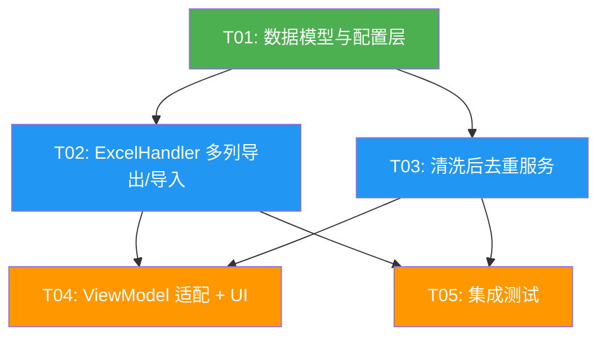

# Phase 3 架构设计：Excel 多列导出 + 清洗后去重

> CADTrans Lite Phase 3 — 增强导出格式与翻译去重
> 架构师：高见远 | 版本：1.0

---

## 1. 实现方案

### 1.1 核心技术挑战

| #   | 挑战                              | 难度  | 解决思路                                                      |
| --- | ------------------------------- | --- | --------------------------------------------------------- |
| C1  | Excel 列布局从 2 列升级到 11 列，需保持向后兼容  | 中   | 自动检测格式（Header 行判断），双路径导入      |
| C2  | 多列格式下 Import 匹配策略——行号 vs Handle | 高   | 优先 Handle 匹配，降级行号匹配；Handle 列标记只读                          |
| C3  | 清洗后去重与现有合并的关系——串行还是互斥           | 中   | 串行执行：先现有合并，再可选清洗后去重                                       |
| C4  | 用户删除/重排 Excel 行后如何正确写回          | 高   | Handle 列做唯一标识，允许用户删除行（仅写回有 Handle 匹配的行）                   |
| C5  | Status 列何时写入                    | 低   | 导出时写入 "pending"/"skipped"，翻译后/导入时更新为 "translated"/"error" |

### 1.2 架构决策

**AD-1：Excel 列布局设计**

采用 11 列固定布局（合并 TableRow/Column 为一列）：

| 列   | 字段             | Header | 说明                               | 样式            |
| --- | -------------- | ------ | -------------------------------- | ------------- |
| A   | Handle         | Handle | 实体句柄                             | 灰色背景 + 只读提示批注 |
| B   | EntityType     | 类型     | TEXT/MTEXT/ATTRIB/TABLE/MLEADER  | 灰色背景          |
| C   | LayerName      | 图层     | 图层名                              | 灰色背景          |
| D   | BlockName      | 块名     | 块名 (可选)                          | 灰色背景          |
| E   | AttributeTag   | 属性标签   | ATTRIB Tag (可选)                  | 灰色背景          |
| F   | TableCellRef   | 表格位置   | R0:C1 格式 (可选)                    | 灰色背景          |
| G   | OriginalText   | 原始文本   | 清洗后可读文本                          | 白色背景          |
| H   | CleanedText    | 清洗文本   | 进一步清洗结果 (可选)                     | 浅灰背景          |
| I   | TranslatedText | 译文     | 用户翻译                             | 淡黄背景          |
| J   | Status         | 状态     | pending/translated/skipped/error | 条件格式          |
| K   | Remark         | 备注     | 备注                               | 白色背景          |

**决策要点**：

- **OriginalText 列（G）展示什么？** 展示 `MTextCodec.StripForTranslation(RawOriginalText)` 的结果——即清洗后的可读文本。这与 Phase 1/2 的导出行为一致。用户看到的是干净的文本，而非带格式码的原文。
- **Handle 列的只读策略**：不使用 EPPlus 的单元格锁定（需要整表保护，体验差），而是加灰色背景 + 批注提示"此列为标识列，请勿修改"。如果用户修改了 Handle，导入时按行号降级匹配。

**AD-2：Import 匹配策略**

```
多列格式：
  1. 读取 Handle 列 → 建立 handle→rowIndex 映射
  2. 对每个 originalItems 中的 item：
     a. 优先按 Handle 精确匹配
     b. Handle 不匹配 → 按行号顺序匹配（兼容旧行为）
  3. 用户删除行 → 对应 item 不更新（TranslatedText 保持原值）
  4. 用户新增行 → 忽略（无 Handle 关联）

2 列格式（向后兼容）：
  保持现有逻辑不变——按行号顺序匹配 + 原文校验
```

**AD-3：清洗后去重策略**

与现有合并串行执行，由 `ImportSettings.EnableCleanedDedup` 控制：

```
rawItems → [TranslationMerger.Merge] → mergedItems
                                            ↓
                              [CleanedDedup (可选)] → dedupedItems
```

- 第一步（现有）：按 `(EntityType, OriginalText, RawOriginalText)` 合并——**始终执行**
- 第二步（新增）：按 `(EntityType, CleanedText)` 二次去重——**可选**
- 清洗后去重时，选择第一个出现的 item 作为代表，其余 item 的 Handle 合并到代表的 `CadHandles` 中
- 去重后的 item 的 `MergedItems` 保持嵌套结构，确保 DwgWriter 能正确展开

**AD-4：Status 列写入时机**

| 阶段  | Status 值     | 条件                   |
| --- | ------------ | -------------------- |
| 导出  | `pending`    | 默认状态                 |
| 导出  | `skipped`    | 被文本清洗器过滤             |
| 翻译后 | `translated` | 翻译成功                 |
| 翻译后 | `error`      | 翻译失败                 |
| 导入  | 沿用导出时的值      | 如果用户修改了译文列，Status 不变 |

---

## 2. 文件列表及相对路径

### 新增文件

| 文件                                                          | 说明                            |
| ----------------------------------------------------------- | ----------------------------- |
| `src/CADTransLite.Core/Models/ExcelFormatConfig.cs`         | Excel 列布局定义（列索引、Header 文本、列宽） |
| `src/CADTransLite.Core/Services/CleanedTextDeduplicator.cs` | 清洗后去重服务                       |

### 修改文件

| 文件                                                    | 修改内容                                            |
| ----------------------------------------------------- | ----------------------------------------------- |
| `src/CADTransLite.Core/Services/ExcelHandler.cs`      | 多列导出/导入 + 格式自动检测 + Handle 匹配                    |
| `src/CADTransLite.Core/Services/TranslationMerger.cs` | 新增 `MergeWithCleanedDedup` 方法                   |
| `src/CADTransLite.Core/Models/ImportSettings.cs`      | 新增 `EnableCleanedDedup`、`UseRichExcelFormat` 属性 |
| `src/CADTransLite.Core/Models/TranslationItem.cs`     | 新增 `TableCellRef` 计算属性                          |
| `src/CADTransLite.Core/Services/DwgExtractor.cs`      | 串联清洗后去重到 `ExtractAndMerge`                      |
| `src/CADTransLite.UI/MainWindowViewModel.cs`          | 新增 ImportSettings 绑定属性                          |
| `src/CADTransLite.UI/MainWindow.xaml`                 | 新增 UI 控件（去重选项、格式选项）                             |

---

## 3. 数据结构变化

### 3.1 ExcelFormatConfig — 新增

```csharp
/// <summary>
/// Excel 多列导出格式的列布局定义。
/// </summary>
public sealed class ExcelFormatConfig
{
    /// <summary>列索引（1-based，EPPlus 约定）。</summary>
    public int ColumnIndex { get; init; }

    /// <summary>Header 文本。</summary>
    public string HeaderText { get; init; } = string.Empty;

    /// <summary>列宽（字符数）。</summary>
    public double Width { get; init; }

    /// <summary>是否为元数据列（灰色背景、只读提示）。</summary>
    public bool IsMetadata { get; init; }

    /// <summary>是否为可编辑数据列。</summary>
    public bool IsEditable { get; init; }
}
```

### 3.2 ImportSettings — 修改

新增字段：

```csharp
/// <summary>
/// 是否启用清洗后去重。启用后，合并阶段会在第一步合并之后，
/// 按 (EntityType, CleanedText) 进行二次去重。
/// 默认 false。
/// </summary>
public bool EnableCleanedDedup { get; set; } = false;

/// <summary>
/// 是否使用多列富元数据 Excel 格式导出。
/// false = 传统 2 列格式（向后兼容）。
/// true = 11 列格式（Handle/类型/图层/原文/清洗/译文/状态等）。
/// 默认 true。
/// </summary>
public bool UseRichExcelFormat { get; set; } = true;
```

### 3.3 TranslationItem — 修改

新增计算属性：

```csharp
/// <summary>
/// 表格单元格定位字符串，格式 "R{row}:C{col}"。
/// 非表格实体返回空字符串。
/// </summary>
public string TableCellRef
{
    get
    {
        if (TableRow < 0 || TableColumn < 0)
            return string.Empty;
        return $"R{TableRow}:C{TableColumn}";
    }
}
```

### 3.4 Excel 列布局常量定义

```csharp
// ExcelHandler 内部常量 — 多列格式
private const int ColHandle       = 1;   // A — Handle
private const int ColEntityType   = 2;   // B — 类型
private const int ColLayerName    = 3;   // C — 图层
private const int ColBlockName    = 4;   // D — 块名
private const int ColAttributeTag = 5;   // E — 属性标签
private const int ColTableCellRef = 6;   // F — 表格位置
private const int ColOriginalText = 7;   // G — 原始文本
private const int ColCleanedText  = 8;   // H — 清洗文本
private const int ColTranslated   = 9;   // I — 译文
private const int ColStatus       = 10;  // J — 状态
private const int ColRemark       = 11;  // K — 备注

private const int RichColumnCount = 11;
```

---

## 4. 接口设计

### 4.1 ExcelHandler — 新签名

```csharp
public sealed class ExcelHandler
{
    // ── 导出 ──

    /// <summary>
    /// 导出翻译条目到 Excel。根据 settings.UseRichExcelFormat
    /// 决定使用 2 列还是 11 列格式。
    /// </summary>
    public void Export(List<TranslationItem> items, string outputPath, ImportSettings settings);

    // 内部分发
    private void ExportRichFormat(List<TranslationItem> items, string outputPath);
    private void ExportLegacyFormat(List<TranslationItem> items, string outputPath);

    // ── 导入 ──

    /// <summary>
    /// 从 Excel 导入翻译结果。自动检测 2 列或 11 列格式。
    /// 多列格式优先按 Handle 匹配，降级行号匹配。
    /// </summary>
    public (List<TranslationItem>? items, string? error) Import(
        string excelPath,
        List<TranslationItem>? originalItems);

    // 内部分发
    private (List<TranslationItem>? items, string? error) ImportRichFormat(
        ExcelWorksheet ws, List<TranslationItem> originalItems, int dataRows);
    private (List<TranslationItem>? items, string? error) ImportLegacyFormat(
        ExcelWorksheet ws, List<TranslationItem>? originalItems, int dataRows);

    // ── 格式检测 ──

    /// <summary>
    /// 检测 Excel 文件是 2 列还是多列格式。
    /// 判断依据：第一行 Header 是否包含 "Handle" 列。
    /// </summary>
    public static bool IsRichFormat(string excelPath);
}
```

**关键：Export 签名变化**

- 现有签名：`Export(List<TranslationItem>, string)`
- 新签名：`Export(List<TranslationItem>, string, ImportSettings)`
- ViewModel 调用处需更新

**Import 返回值不变**，仍返回 `(List<TranslationItem>?, string?)`。但内部匹配逻辑因格式不同而异：

| 格式   | 匹配方式           | 原文校验        | 行数校验       |
| ---- | -------------- | ----------- | ---------- |
| 2 列  | 按行号顺序          | 强制（原文不可修改）  | 强制（行数一致）   |
| 11 列 | 优先 Handle，降级行号 | 不强制（仅 warn） | 不强制（允许增删行） |

### 4.2 CleanedTextDeduplicator — 新增

```csharp
/// <summary>
/// 清洗后去重服务。将 CleanedText 相同的合并条目进一步去重。
/// 在 TranslationMerger.Merge 之后执行。
/// </summary>
public static class CleanedTextDeduplicator
{
    /// <summary>
    /// 对已合并的条目进行清洗后二次去重。
    /// 按 (EntityType, CleanedText) 分组，相同的条目共享翻译结果。
    /// </summary>
    /// <param name="mergedItems">TranslationMerger.Merge 的输出。</param>
    /// <returns>去重后的条目列表。</returns>
    public static List<TranslationItem> Deduplicate(List<TranslationItem> mergedItems);
}
```

**去重逻辑详述**：

1. 按 `(EntityType, CleanedText)` 分组
2. CleanedText 为 null 或空的 item 不参与去重（保留原样）
3. 每组取第一个 item 作为代表
4. 其余 item 的 `Handle` 和 `CadHandles` 合并到代表的 `CadHandles` 中
5. 其余 item 追加到代表的 `MergedItems` 中
6. 代表的 `OriginalText` 保持第一个 item 的值（即展示原始文本）

### 4.3 TranslationMerger — 修改

新增便捷方法（不改变现有 Merge 签名）：

```csharp
public static class TranslationMerger
{
    // 现有方法不变
    public static List<TranslationItem> Merge(List<TranslationItem> rawItems);

    // 新增：合并 + 可选清洗后去重
    public static List<TranslationItem> Merge(
        List<TranslationItem> rawItems,
        bool enableCleanedDedup);
}
```

### 4.4 DwgExtractor — 修改

`ExtractAndMerge` 方法增加清洗后去重步骤：

```csharp
public (List<TranslationItem> mergedItems, int rawItemCount) ExtractAndMerge(
    string filePath,
    ImportSettings settings,    // 新增参数
    IProgress<(int, int, string)>? progress = null)
{
    List<TranslationItem> rawItems = Extract(filePath, progress);
    int rawCount = rawItems.Count;

    List<TranslationItem> merged = TranslationMerger.Merge(rawItems, settings.EnableCleanedDedup);

    return (merged, rawCount);
}
```

---

## 5. 向后兼容策略

### 5.1 格式自动检测

```csharp
public static bool IsRichFormat(string excelPath)
{
    using var package = new ExcelPackage(new FileInfo(excelPath));
    var ws = package.Workbook.Worksheets.FirstOrDefault();
    if (ws is null) return false;

    // 检查第一行第一个单元格是否为 "Handle"
    string firstHeader = ws.Cells[1, 1].GetValue<string>()?.Trim() ?? string.Empty;
    return string.Equals(firstHeader, "Handle", StringComparison.OrdinalIgnoreCase);
}
```

- Header = "Handle" → 多列格式，走 `ImportRichFormat`
- Header = "原文" → 2 列格式，走 `ImportLegacyFormat`（现有逻辑）

### 5.2 导出格式选择

- `ImportSettings.UseRichExcelFormat = true`（默认） → 11 列格式
- `ImportSettings.UseRichExcelFormat = false` → 2 列格式（旧版兼容）

### 5.3 导入行为差异

| 场景          | 2 列格式       | 11 列格式              |
| ----------- | ----------- | ------------------- |
| 用户修改原文列     | ❌ 报错拒绝      | ⚠️ 警告但允许            |
| 用户删除行       | ❌ 报错（行数不匹配） | ✅ 允许（Handle 无匹配则跳过） |
| 用户新增行       | ❌ 不支持       | ✅ 允许（无 Handle 的行忽略） |
| 用户修改 Handle | N/A         | ⚠️ 匹配失败时降级行号匹配      |

### 5.4 ViewModel 兼容

`MainWindowViewModel` 中调用 `ExcelHandler.Export` 的地方需传入 `ImportSettings`：

```csharp
// 旧
_excelHandler.Export(items, path);
// 新
_excelHandler.Export(items, path, _importSettings);
```

---

## 6. 任务列表

### T01: 数据模型与配置层

**源文件**：

- `src/CADTransLite.Core/Models/ExcelFormatConfig.cs`（新建）
- `src/CADTransLite.Core/Models/ImportSettings.cs`（修改）
- `src/CADTransLite.Core/Models/TranslationItem.cs`（修改）

**内容**：

1. 新建 `ExcelFormatConfig` 类，定义 11 列布局常量和列配置列表
2. `ImportSettings` 新增 `EnableCleanedDedup` 和 `UseRichExcelFormat` 属性
3. `TranslationItem` 新增 `TableCellRef` 计算属性

**依赖**：无
**优先级**：P0

---

### T02: ExcelHandler 多列导出/导入核心

**源文件**：

- `src/CADTransLite.Core/Services/ExcelHandler.cs`（重构）

**内容**：

1. 新增 `Export(List<TranslationItem>, string, ImportSettings)` 方法，内部分发到 `ExportRichFormat` / `ExportLegacyFormat`
2. 实现 `ExportRichFormat`：11 列导出，Handle 列灰色背景 + 批注，Status 列条件格式
3. 实现 `ImportRichFormat`：Handle 优先匹配 → 行号降级匹配，允许行删除
4. 实现 `IsRichFormat` 格式检测静态方法
5. 保留 `ExportLegacyFormat` / `ImportLegacyFormat` 为现有逻辑的包装
6. 列宽设置：Handle=12, EntityType=10, Layer=15, BlockName=15, AttributeTag=12, TableCellRef=10, OriginalText=60, CleanedText=40, Translated=60, Status=10, Remark=20
7. 冻结首行 + 前 6 列（元数据区）

**依赖**：T01
**优先级**：P0

---

### T03: 清洗后去重服务

**源文件**：

- `src/CADTransLite.Core/Services/CleanedTextDeduplicator.cs`（新建）
- `src/CADTransLite.Core/Services/TranslationMerger.cs`（修改）
- `src/CADTransLite.Core/Services/DwgExtractor.cs`（修改）

**内容**：

1. 新建 `CleanedTextDeduplicator` 静态类，实现 `Deduplicate` 方法
2. `TranslationMerger` 新增 `Merge(rawItems, enableCleanedDedup)` 重载
3. `DwgExtractor.ExtractAndMerge` 接受 `ImportSettings` 参数，串联清洗后去重
4. 确保去重后的 `CadHandles` 和 `MergedItems` 正确合并，DwgWriter 可正确展开

**依赖**：T01
**优先级**：P0

---

### T04: ViewModel 适配 + UI 控件

**源文件**：

- `src/CADTransLite.UI/MainWindowViewModel.cs`（修改）
- `src/CADTransLite.UI/MainWindow.xaml`（修改）

**内容**：

1. ViewModel 新增 `EnableCleanedDedup` 和 `UseRichExcelFormat` 绑定属性
2. 更新 `ExtractAndExportAsync` 和 `ImportAndWriteBackAsync` 方法，传入新参数
3. Settings 保存/加载新增字段
4. XAML 新增两个 Checkbox 控件在设置区域

**依赖**：T02, T03
**优先级**：P1

---

### T05: 集成测试与向后兼容验证

**源文件**：

- `src/CADTransLite.Tests/ExcelHandlerTests.cs`（新建/修改）
- `src/CADTransLite.Tests/CleanedDedupTests.cs`（新建）
- `src/CADTransLite.Tests/MergerIntegrationTests.cs`（新建/修改）

**内容**：

1. 测试多列导出 → 导入闭环（Handle 匹配、行删除、原文修改）
2. 测试 2 列导出 → 导入闭环（向后兼容）
3. 测试格式自动检测（IsRichFormat）
4. 测试清洗后去重（相同 CleanedText 合并、CadHandles 合并）
5. 测试清洗后去重 + DwgWriter 展开闭环
6. 测试混合场景：2 列 Excel 导入到新系统

**依赖**：T02, T03
**优先级**：P1

---

## 7. 依赖包列表

| 包      | 版本       | 用途       | 状态   |
| ------ | -------- | -------- | ---- |
| EPPlus | 已有 (7.x) | Excel 读写 | 无需新增 |
| netDxf | 已有       | DXF 解析   | 无需新增 |

**无需新增 NuGet 包**。Phase 3 的所有功能均可基于现有依赖实现。

---

## 8. 共享知识

### 8.1 Excel 格式约定

- 所有 Excel 数据从第 2 行开始（第 1 行为 Header）
- Handle 列格式：TEXT/MTEXT = `"1A3F"`，ATTRIB = `"1A3F::TAG1"`，TABLE = `"1A3F::R0::C1"`，MLEADER = `"1A3F::CTX"`
- EntityType 列值：`TEXT` / `MTEXT` / `ATTRIB` / `TABLE` / `MLEADER`
- TableCellRef 格式：`R{row}:C{col}`，非表格实体为空字符串
- Status 列值：`pending` / `translated` / `skipped` / `error`

### 8.2 导出文本处理

- OriginalText 列（G）：始终使用 `MTextCodec.StripForTranslation(rawText)` 清理后的可读文本
- CleanedText 列（H）：使用 `DxfTextCleaner.Clean()` 的结果，进一步去除数字/符号/编码
- TranslatedText 列（I）：同样使用 `MTextCodec.StripForTranslation()` 清理，与 Phase 1/2 行为一致

### 8.3 导入匹配优先级

```
多列格式：Handle 精确匹配 → 行号顺序匹配（降级）
2 列格式：行号顺序匹配 + 原文校验（现有行为不变）
```

### 8.4 去重链条

```
rawItems → TranslationMerger.Merge (按 EntityType+OriginalText+RawOriginalText)
         → [可选] CleanedTextDeduplicator.Deduplicate (按 EntityType+CleanedText)
         → dedupedItems → Excel 导出
```

### 8.5 CloneItem 必须同步

以下文件中有 `CloneItem` 方法，新增 `TranslationItem` 属性时需同步更新：

1. `ExcelHandler.cs` → CloneItem
2. `DwgWriter.cs` → CloneItem
3. 新增的 `CleanedTextDeduplicator` 中如果需要深拷贝

### 8.6 ExcelRowIndex 用途变化

- 2 列格式：`ExcelRowIndex` 用于导入时按行号定位
- 11 列格式：`ExcelRowIndex` 仅用于调试/日志，不再作为主要匹配键（由 Handle 替代）

---

## 9. 待明确事项

| #   | 问题                                      | 当前假设      | 建议                              |
| --- | --------------------------------------- | --------- | ------------------------------- |
| 1   | 多列格式下，如果 Handle 列为空（用户清空了），是否降级行号匹配？    | 是         | 建议降级，行号匹配时 warn                 |
| 2   | CleanedText 列是否需要用户可编辑？                 | 否（只读展示）   | 清洗结果仅供参考，不应手动修改                 |
| 3   | 导出时 Status 列是否展示 skipped 条目？            | 是         | 展示所有条目，包括 skipped，方便用户审计        |
| 4   | 清洗后去重是否跨 EntityType 去重？                 | 否         | 仅同 EntityType 内去重，不同类型的文本不应共享翻译 |
| 5   | 2 列格式是否也支持 EnableCleanedDedup？          | 是         | 去重在导出前执行，与 Excel 格式无关           |
| 6   | DwgExtractor.ExtractAndMerge 签名变更是破坏性变更 | 需要检查所有调用点 | 已确认 ViewModel 为唯一调用点            |

---

## 10. 任务依赖图


