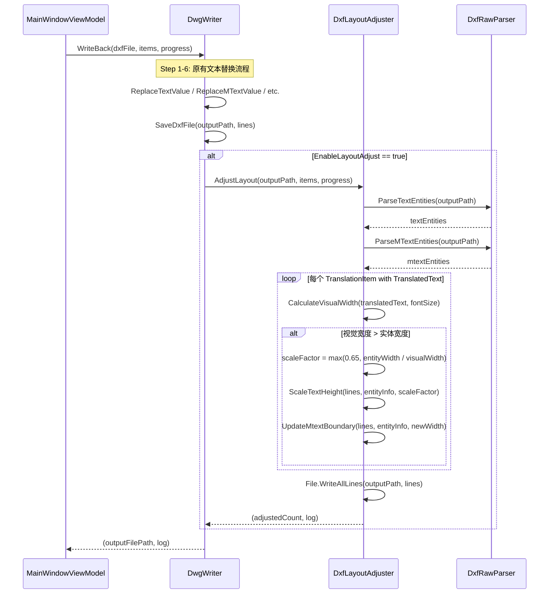
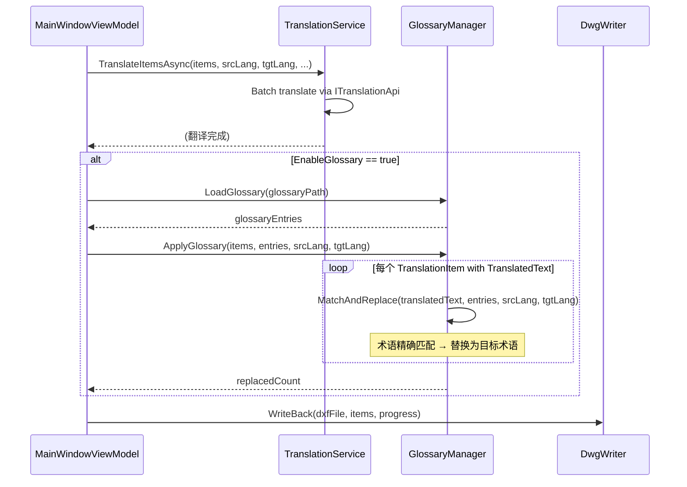
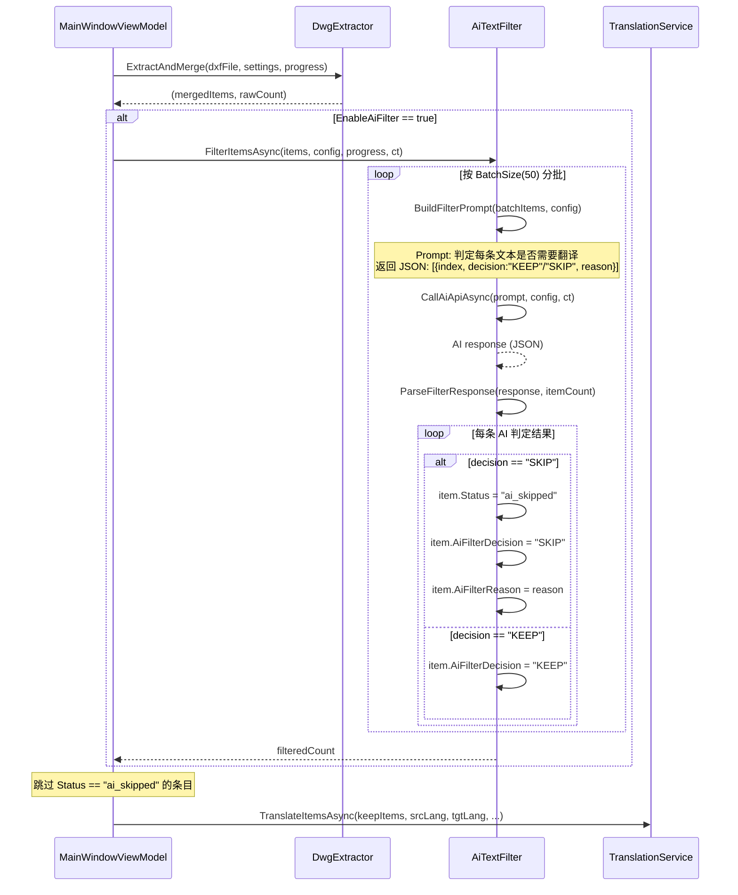
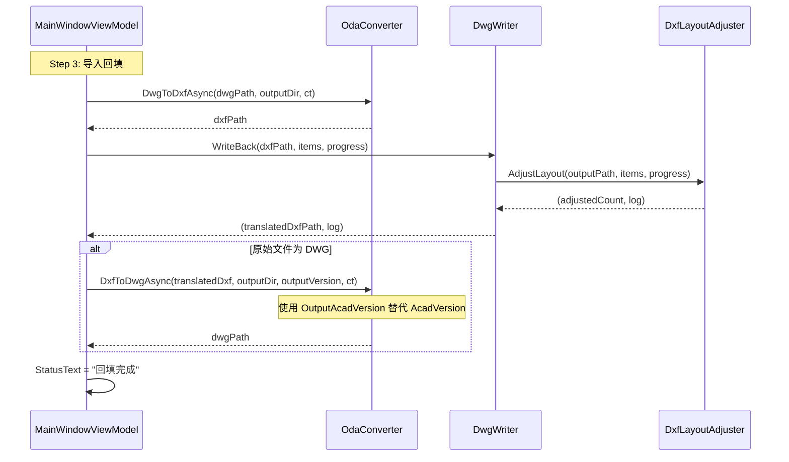
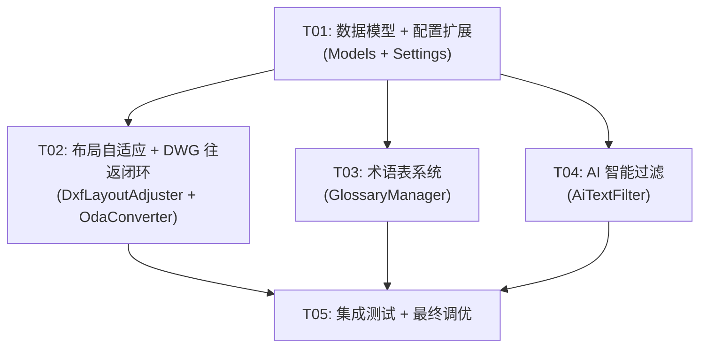

# CADTrans Lite v3.0 Phase 4 — 系统架构设计

> **版本**: Phase 4 Architecture v1.0  
> **架构师**: 高见远 (Gao)  
> **日期**: 2025-07  
> **基线**: Phase 1-3 已完成，DwgWriter 使用纯原始 DXF 文本替换

---

## Part A: 系统设计

### 1. 实现方案

#### 核心技术挑战

| # | 挑战 | 分析 | 方案 |
|---|------|------|------|
| V3-4.1 | 布局自适应 | 翻译后文字可能超出原始边界框，需要在原始 DXF 文本替换框架下修改组码值（字高组码40、MTEXT边界宽度组码41） | DxfLayoutAdjuster 在 DwgWriter 回写后追加执行：基于 DxfRawParser 的实体定位信息，计算译文视觉宽度 vs 原始边界宽度，若溢出则按比例缩放字高（最低 0.65x），同时更新 MTEXT RectangleWidth |
| V3-4.2 | 术语表系统 | 需要在翻译流程中插入术语约束替换步骤，术语数据需要持久化和 UI 管理 | GlossaryManager 加载术语表（JSON），在 TranslationService.TranslateItemsAsync 之后、DwgWriter.WriteBack 之前执行术语替换；术语数据存储在 `%APPDATA%/CADTransLite/glossary/` |
| V3-4.3 | AI 智能过滤 | 需要调用 AI API 判定文本是否值得翻译，复用现有 CustomAiTranslator 的 API 配置 | AiTextFilter 新增 IAiFilterApi 接口，内部复用 TranslationApiSettings 的 ApiKey/BaseUrl/ModelName，在提取阶段后批量调用 AI（prompt 模板可自定义），标记 KEEP/SKIP |
| V3-4.4 | DWG 往返闭环 | 当前 ImportAndWriteBackAsync 已支持 DWG→DXF→回写→DXF→DWG，但 AcadVersion 固定为 ACAD2018；需支持用户选择输出版本 | OdaConverter 已有 AcadVersion 参数，需暴露到 OdaSettings/UserSettings 并在 UI 提供版本选择 ComboBox；同时确保 DXF→DWG 转换在回写后自动执行 |

#### 框架和库选型

| 用途 | 选型 | 理由 |
|------|------|------|
| AI API 调用 | 复用 HttpClient + System.Text.Json | 与 CustomAiTranslator 保持一致，无需引入新依赖 |
| 术语表持久化 | System.Text.Json | 与 SettingsManager 保持一致 |
| MTEXT 视觉宽度计算 | 复用 MTextRebuilder 的 GetCharWidth 逻辑 | 已有字符宽度映射（ASCII=0.55, CJK=1.0, Space=0.35），无需重复实现 |
| DXF 组码操作 | 复用 DxfRawParser + 行级替换 | 与 DwgWriter 同一框架，零侵入 |

#### 架构模式

延续现有 MVVM 模式：
- **Model 层** (CADTransLite.Core/Models): 新增数据模型
- **Service 层** (CADTransLite.Core/Services): 新增业务服务
- **ViewModel 层** (CADTransLite.UI/MainWindowViewModel): 扩展现有 VM
- **View 层** (CADTransLite.UI): 扩展 XAML 界面

---

### 2. 文件列表

#### 新增文件

| 文件路径 | 说明 |
|----------|------|
| `CADTransLite.Core/Services/DxfLayoutAdjuster.cs` | 布局自适应服务：字高缩放 + MTEXT 边界刷新 |
| `CADTransLite.Core/Services/GlossaryManager.cs` | 术语表管理：加载/保存/应用术语替换 |
| `CADTransLite.Core/Services/AiTextFilter.cs` | AI 智能过滤：调用 AI API 判定 KEEP/SKIP |
| `CADTransLite.Core/Models/GlossaryEntry.cs` | 术语条目数据模型 |
| `CADTransLite.Core/Models/GlossaryConfig.cs` | 术语表配置（含术语列表文件路径） |
| `CADTransLite.Core/Models/AiFilterConfig.cs` | AI 过滤配置（prompt 模板、模型参数） |
| `CADTransLite.Core/Models/DwgOutputVersion.cs` | DWG 输出版本选项定义 |

#### 修改文件

| 文件路径 | 修改内容 |
|----------|----------|
| `CADTransLite.Core/Services/DwgWriter.cs` | WriteBack 方法末尾调用 DxfLayoutAdjuster.AdjustLayout |
| `CADTransLite.Core/Services/OdaConverter.cs` | DxfToDwgAsync 增加版本参数重载 |
| `CADTransLite.Core/Models/OdaSettings.cs` | 新增 OutputAcadVersion 属性 |
| `CADTransLite.Core/Models/UserSettings.cs` | 新增 Glossary/AiFilter/OutputVersion/EnableLayoutAdjust/EnableAiFilter/EnableGlossary 字段 |
| `CADTransLite.Core/Models/ImportSettings.cs` | 新增 EnableLayoutAdjust/EnableAiFilter/EnableGlossary 开关 |
| `CADTransLite.Core/Models/TranslationItem.cs` | 新增 AiFilterDecision/AiFilterReason 字段 |
| `CADTransLite.Core/Models/TranslationApiSettings.cs` | 新增 AiFilterPrompt/AiFilterModelName 字段 |
| `CADTransLite.Core/Services/TranslationService.cs` | 翻译后集成 GlossaryManager.ApplyGlossary |
| `CADTransLite.UI/MainWindowViewModel.cs` | 新增 Phase 4 属性、命令、流程集成 |
| `CADTransLite.UI/MainWindow.xaml` | 新增 Phase 4 设置面板 UI |
| `CADTransLite.Core/CADTransLite.Core.csproj` | 无需新增包（复用现有依赖） |

---

### 3. 数据结构和接口

```mermaid
classDiagram
    direction TB

    class DxfLayoutAdjuster {
        -double _minScaleFactor
        +double MinScaleFactor$
        +AdjustLayout(dxfFilePath, items, progress) (int, List~string~)
        -CalculateVisualWidth(text, fontSize) double
        -FindAndModifyGroupCode(lines, handle, groupCode, newValue) bool
        -ScaleTextHeight(lines, textInfo, scaleFactor) bool
        -UpdateMtextBoundary(lines, mtextInfo, newWidth) bool
    }

    class GlossaryManager {
        -string _glossaryDirectory$
        +LoadGlossary(glossaryPath) List~GlossaryEntry~
        +SaveGlossary(entries, glossaryPath) void
        +ApplyGlossary(items, entries, sourceLang, targetLang) int
        -MatchAndReplace(text, entries, sourceLang, targetLang) string
        +GetDefaultGlossaryPath() string
        +EnsureDefaultGlossary() void
    }

    class AiTextFilter {
        -TranslationApiSettings _settings
        -HttpClient _httpClient
        +FilterItemsAsync(items, config, progress, cancellationToken) Task~int~
        -BuildFilterPrompt(items, config) string
        -ParseFilterResponse(response, itemCount) List~AiFilterDecision~
        -CallAiApiAsync(prompt, config, cancellationToken) Task~string~
    }

    class GlossaryEntry {
        +string SourceTerm
        +string TargetTerm
        +string SourceLang
        +string TargetLang
        +bool IsCaseSensitive
        +bool IsRegex
        +string Category
        +string Remark
    }

    class GlossaryConfig {
        +string GlossaryPath
        +bool EnableGlossary
        +bool AutoMatchCase
        +List~GlossaryEntry~ Entries
    }

    class AiFilterConfig {
        +string FilterPrompt
        +string ModelName
        +bool ProtectTableHeaders
        +int BatchSize
        +string SourceLang
        +string TargetLang
    }

    class DwgOutputVersion {
        <<static>>
        +string VersionCode
        +string DisplayName
        +GetAllVersions() List~DwgOutputVersion~
        +GetDefault() DwgOutputVersion
    }

    class OdaSettings {
        +string ExecutablePath
        +string AcadVersion
        +string OutputAcadVersion
        +bool IsAvailable
        +DefaultExecutablePath$
    }

    class TranslationItem {
        +string Handle
        +EntityType EntityType
        +string RawOriginalText
        +string OriginalText
        +string TranslatedText
        +Dictionary~string,string~ FormatPlaceholders
        +string LayerName
        +int ExcelRowIndex
        +List~string~ CadHandles
        +List~TranslationItem~ MergedItems
        +string BlockName
        +string AttributeTag
        +int TableRow
        +int TableColumn
        +string FilterReason
        +string CleanedText
        +string Status
        +string Remark
        +string AiFilterDecision  %% Phase 4: KEEP/SKIP
        +string AiFilterReason   %% Phase 4: AI filter reason
    }

    class UserSettings {
        +string OdaPath
        +ImportSettings Import
        +string ExportSuffix
        +TranslationApiSettings TranslationApi
        +string SourceLanguageCode
        +string TargetLanguageCode
        +string SelectedProvider
        +bool EnableLayoutAdjust     %% Phase 4
        +bool EnableGlossary         %% Phase 4
        +string GlossaryPath         %% Phase 4
        +bool EnableAiFilter         %% Phase 4
        +string AiFilterPrompt       %% Phase 4
        +string AiFilterModelName    %% Phase 4
        +string OutputDwgVersion     %% Phase 4
    }

    class ImportSettings {
        +bool ImportProxyObjects
        +bool ImportBlockAttributes
        +bool ImportDimensionText
        +bool ImportMTextParagraph
        +bool ImportMTextWhole
        +bool ImportFrozenLayers
        +bool ImportLockedLayers
        +bool ImportOffLayers
        +DxfTextCleanerConfig CleanerConfig
        +bool EnableTextCleaning
        +bool ImportAcadTables
        +bool ImportMultiLeaders
        +bool EnableCleanedDedup
        +bool UseRichExcelFormat
        +bool EnableLayoutAdjust  %% Phase 4
        +bool EnableAiFilter      %% Phase 4
        +bool EnableGlossary      %% Phase 4
    }

    class TranslationApiSettings {
        +bool EnableCustomAI
        +string ApiKey
        +string BaseUrl
        +string ModelName
        +bool EnableDeepL
        +string DeepLApiKey
        +bool EnableBaiduTranslate
        +string BaiduAppId
        +string BaiduAppKey
        +bool EnableTencentTranslate
        +string TencentSecretId
        +string TencentSecretKey
        +bool EnableMicrosoftTranslate
        +string MicrosoftApiKey
        +string MicrosoftRegion
        +bool EnableDeepLX
        +string DeepLXUrl
        +string AiFilterPrompt    %% Phase 4
        +string AiFilterModelName %% Phase 4
    }

    DxfLayoutAdjuster --> TranslationItem : adjusts
    DxfLayoutAdjuster --> DxfRawParser : uses
    GlossaryManager --> GlossaryEntry : manages
    GlossaryManager --> TranslationItem : applies to
    AiTextFilter --> TranslationItem : filters
    AiTextFilter --> TranslationApiSettings : uses config
    AiTextFilter --> AiFilterConfig : configured by
    UserSettings --> ImportSettings : contains
    UserSettings --> TranslationApiSettings : contains
    UserSettings --> DwgOutputVersion : references
    OdaSettings --> DwgOutputVersion : uses version
```



---

### 4. 程序调用流程

#### 4.1 布局自适应流程（V3-4.1）



#### 4.2 术语表应用流程（V3-4.2）



#### 4.3 AI 智能过滤流程（V3-4.3）



#### 4.4 DWG 往返闭环流程（V3-4.4）



---

### 5. 待明确事项

| # | 事项 | 假设 | 需确认 |
|---|------|------|--------|
| 1 | ODA File Converter 是否支持不同版本 DXF→DWG 转换 | ODA CLI 的第3个参数即为版本号（ACAD2018/ACAD2013/ACAD2010 等），已验证 DxfToDwgAsync 使用 AcadVersion 参数 | 需测试不同版本参数的实际效果 |
| 2 | AI 过滤的 Prompt 模板默认内容 | 默认 prompt 为："你是一个 CAD 图纸翻译审核专家。请判断以下文本是否需要从{sourceLang}翻译为{targetLang}。返回 JSON 数组..." | 需与产品确认默认 prompt |
| 3 | 术语表默认内容 | 初始化空术语表，用户自行添加 | 需确认是否需要预置常见术语 |
| 4 | 布局自适应是否影响 TEXT 实体 | 仅对 MTEXT 和 TEXT 实体做字高缩放，TableCell/MLeader/Attribute 暂不调整 | 需确认是否扩展到所有实体类型 |
| 5 | AI 过滤与 DxfTextCleaner 的关系 | AI 过滤在 DxfTextCleaner 之后执行，仅对未被清洗器过滤的条目生效 | 需确认执行顺序 |
| 6 | 术语替换策略 | 精确匹配（区分大小写可选），不支持正则（V1） | 需确认是否需要正则支持 |

---

## Part B: 任务分解

### 6. 所需包

```
# Phase 4 无需新增 NuGet 包
# 所有功能复用现有依赖：
# - System.Text.Json (内置): 术语表 JSON 持久化
# - System.Net.Http (内置): AI 过滤 API 调用
# - EPPlus 7.5.2 (已有): Excel 导出（可能新增 AI 过滤状态列）
# - netDxf 2022.11.2 (已有): DXF 解析（DxfLayoutAdjuster 需要）
# - CommunityToolkit.Mvvm 8.2.1 (已有): ViewModel 命令绑定
```

### 7. 任务列表

#### T01: 项目基础设施 — Phase 4 数据模型 + 配置扩展

**源文件**:
- `CADTransLite.Core/Models/GlossaryEntry.cs` (新建)
- `CADTransLite.Core/Models/GlossaryConfig.cs` (新建)
- `CADTransLite.Core/Models/AiFilterConfig.cs` (新建)
- `CADTransLite.Core/Models/DwgOutputVersion.cs` (新建)
- `CADTransLite.Core/Models/TranslationItem.cs` (修改: +AiFilterDecision, +AiFilterReason)
- `CADTransLite.Core/Models/UserSettings.cs` (修改: +Phase4 字段)
- `CADTransLite.Core/Models/ImportSettings.cs` (修改: +Phase4 开关)
- `CADTransLite.Core/Models/TranslationApiSettings.cs` (修改: +AiFilter 字段)
- `CADTransLite.Core/Models/OdaSettings.cs` (修改: +OutputAcadVersion)

**依赖**: 无  
**优先级**: P0  
**说明**: 建立所有 Phase 4 需要的数据模型和配置字段。这些是后续所有功能的基础。

#### T02: 布局自适应 + DWG 往返闭环

**源文件**:
- `CADTransLite.Core/Services/DxfLayoutAdjuster.cs` (新建)
- `CADTransLite.Core/Services/DwgWriter.cs` (修改: 调用 DxfLayoutAdjuster)
- `CADTransLite.Core/Services/OdaConverter.cs` (修改: DxfToDwgAsync 支持版本参数)
- `CADTransLite.UI/MainWindowViewModel.cs` (修改: Phase 4 属性 + 流程集成)
- `CADTransLite.UI/MainWindow.xaml` (修改: DWG 版本选择 UI + 布局自适应开关)

**依赖**: T01  
**优先级**: P0  
**说明**: 实现翻译后文字过长时的自动缩放（最低 0.65x）和 MTEXT 边界刷新；DWG 输出版本选择和自动往返转换。这是用户体验的核心改进。

#### T03: 术语表系统

**源文件**:
- `CADTransLite.Core/Services/GlossaryManager.cs` (新建)
- `CADTransLite.Core/Services/TranslationService.cs` (修改: 集成术语替换)
- `CADTransLite.UI/MainWindowViewModel.cs` (修改: 术语管理命令)
- `CADTransLite.UI/MainWindow.xaml` (修改: 术语设置面板 UI)

**依赖**: T01  
**优先级**: P1  
**说明**: 术语表 JSON 持久化、加载/保存/应用术语替换。在翻译完成后、回写前执行术语替换，确保专业术语一致性。

#### T04: AI 智能过滤

**源文件**:
- `CADTransLite.Core/Services/AiTextFilter.cs` (新建)
- `CADTransLite.Core/Services/DwgExtractor.cs` (修改: 提取后集成 AI 过滤)
- `CADTransLite.UI/MainWindowViewModel.cs` (修改: AI 过滤命令 + 配置)
- `CADTransLite.UI/MainWindow.xaml` (修改: AI 过滤设置面板 UI)
- `CADTransLite.Core/Services/ExcelHandler.cs` (修改: Rich 格式新增 AI 过滤状态列)

**依赖**: T01  
**优先级**: P1  
**说明**: 调用 AI API 判定文本 KEEP/SKIP，保护表头，自定义 prompt 模板。在提取阶段后、翻译前执行过滤。

#### T05: 集成测试 + 最终调优

**源文件**:
- `CADTransLite.UI/MainWindowViewModel.cs` (修改: 完善流程串联)
- `CADTransLite.UI/MainWindow.xaml` (修改: 最终 UI 布局优化)
- `CADTransLite.Core/Services/DwgWriter.cs` (修改: 日志增强)
- `CADTransLite.Core/Services/SettingsManager.cs` (无修改: 自动兼容新字段)

**依赖**: T02, T03, T04  
**优先级**: P1  
**说明**: 确保四个 Phase 4 功能协同工作：提取→AI过滤→翻译→术语替换→回写→布局调整→DWG转换。端到端测试 + UI 最终优化。

### 8. 共享知识

```
- DwgWriter 使用纯原始 DXF 文本替换（File.Copy + 行级替换），所有 Phase 4 DXF 修改必须在此框架下实现
- ODA CLI 参数格式: ODAFileConverter.exe "<input_dir>" "<output_dir>" <version> <format> <recurse> <audit> <filter>
  - version: ACAD2018/ACAD2013/ACAD2010/ACAD2007/ACAD2004/ACAD2000
  - format: DXF 或 DWG
- DxfRawParser 是所有 DXF 实体定位的基础：通过 Handle 查找行号，通过组码修改值
  - TEXT: 组码 40 = 字高，组码 1 = 文本值
  - MTEXT: 组码 40 = 字高，组码 41 = RectangleWidth，组码 1 = 文本值
- MTextRebuilder 已有字符宽度映射: ASCII=0.55, CJK=1.0, Space=0.35
- CustomAiTranslator 使用 OpenAI 兼容 API 格式 (POST /chat/completions)
  - AI 过滤复用相同 API 格式和配置（ApiKey/BaseUrl/ModelName）
- UserSettings 持久化到 %APPDATA%/CADTransLite/settings.json (camelCase)
- 术语表存储在 %APPDATA%/CADTransLite/glossary/*.json
- TranslationItem.Status 取值: pending/translated/skipped/error/ai_skipped
- 所有 IProgress 报告格式: (int current, int total, string message)
- Excel Rich 格式固定 11 列（Phase 4 不新增列，AI 过滤状态写入现有 Status 列）
- EntityType 枚举: Text, MText, Attribute, TableCell, MLeader
```

### 9. 任务依赖图



---

## 附录: 关键实现细节

### A. DxfLayoutAdjuster 核心算法

```
1. 读取已回写的 DXF 文件
2. 通过 DxfRawParser.ParseTextEntities / ParseMTextEntities 获取实体定位信息
3. 对每个有 TranslatedText 的 TranslationItem:
   a. 计算译文视觉宽度 = Σ charWidth(ch) (复用 MTextRebuilder 宽度映射)
   b. 获取原始字高 (组码 40) 和实体宽度 (组码 41 for MTEXT)
   c. 若 视觉宽度 × 字高 > 实体宽度:
      - scaleFactor = max(0.65, 实体宽度 / (视觉宽度 × 字高))
      - 新字高 = 原始字高 × scaleFactor
      - 更新 DXF 行数组中组码 40 对应行的值
      - 对 MTEXT: 更新 RectangleWidth (组码 41) = 视觉宽度 × 新字高
4. 保存修改后的行数组回 DXF 文件
```

### B. AiTextFilter Prompt 模板

```
你是一个 CAD 图纸翻译审核专家。请判断以下文本是否需要从{sourceLang}翻译为{targetLang}。

判定标准：
- KEEP: 需要翻译的文本（包含源语言文字、技术描述、说明等）
- SKIP: 不需要翻译的文本（纯数字、符号、代码、已为目标语言、表头标记等）

{customPrompt}

请以 JSON 数组格式返回结果：
[{{"index": 0, "decision": "KEEP/SKIP", "reason": "原因"}}]

待判定文本：
{itemsJson}
```

### C. GlossaryManager 术语替换逻辑

```
对每个 TranslationItem.TranslatedText:
  对每个 GlossaryEntry (按 Category 分组, 精确匹配优先):
    if entry.SourceLang matches item source language:
      if entry.IsRegex:
        TranslatedText = Regex.Replace(TranslatedText, entry.SourceTerm, entry.TargetTerm)
      else if entry.IsCaseSensitive:
        TranslatedText = TranslatedText.Replace(entry.SourceTerm, entry.TargetTerm)
      else:
        TranslatedText = TranslatedText.Replace(
          entry.SourceTerm, entry.TargetTerm, StringComparison.OrdinalIgnoreCase)
```

### D. DWG 输出版本选项

| 版本代码 | 显示名称 | 说明 |
|----------|---------|------|
| ACAD2018 | AutoCAD 2018 DWG | 默认 |
| ACAD2013 | AutoCAD 2013 DWG | |
| ACAD2010 | AutoCAD 2010 DWG | |
| ACAD2007 | AutoCAD 2007 DWG | |
| ACAD2004 | AutoCAD 2004 DWG | |
| ACAD2000 | AutoCAD 2000 DWG | 兼容性最广 |
